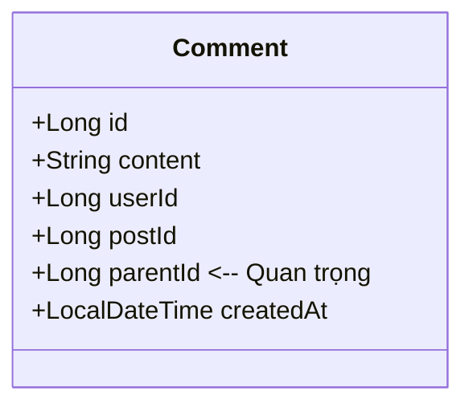
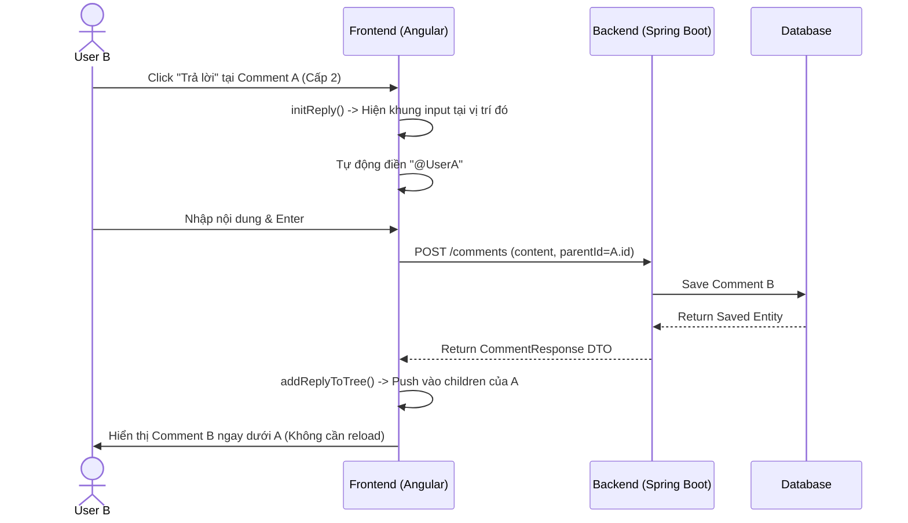

# Tài liệu thiết kế: Tính năng Bình luận (Nested Comments)

## 1. Tổng quan
Hệ thống bình luận hỗ trợ trả lời phân cấp (Nested/Threaded Comments) với cơ chế hiển thị đặc biệt để tối ưu trải nghiệm người dùng trên cả desktop và mobile.

### Quy tắc hiển thị
1.  **Cấp 1 & 2:** Hiển thị thụt đầu dòng (Indentation) rõ ràng.
2.  **Cấp 3 trở đi (Flattening):** Từ cấp 3 trở xuống (Cấp 4, 5, n...), các bình luận sẽ **không thụt lề thêm nữa** mà hiển thị thẳng hàng với Cấp 3.
3.  **Vô hạn cấp:** Hỗ trợ trả lời vô tận thông qua đệ quy (Recursive rendering).

## 2. Cấu trúc dữ liệu (Database & DTO)

Mỗi bình luận lưu trữ `parentId` để xác định cha của nó.



## 3. Luồng xử lý dữ liệu (Frontend Logic)

### 3.1. Chuyển đổi danh sách (Flat to Tree)
Backend trả về một danh sách phẳng (Flat List). Frontend (`home.component.ts`) sẽ chuyển đổi thành cấu trúc Cây (Tree) trước khi hiển thị.

```mermaid
flowchart LR
    A[API trả về List phẳng] --> B{Có parentId?}
    B -- Không --> C[Là Root (Cấp 1)]
    B -- Có --> D[Tìm cha trong Map]
    D --> E[Push vào children của cha]
    E --> F[Cấu trúc Tree hoàn chỉnh]
```

### 3.2. Cơ chế Render (View)
Sử dụng `ng-template` và `ngTemplateOutlet` để xử lý đệ quy.

1.  **Level 1 Loop:** Render bình thường.
2.  **Level 2 Loop:** Render bình thường (thụt lề CSS).
3.  **Level 3+ Loop (Recursive):**
    * Gọi template `#recursiveReplies`.
    * Render comment.
    * Nếu có con -> Gọi lại `#recursiveReplies` ngay tại chỗ (không tạo thêm div thụt lề).

## 4. Biểu đồ tuần tự (Sequence Diagram) - Luồng Trả lời

Mô tả quá trình người dùng B trả lời bình luận của người dùng A.



## 5. CSS & UI Notes
* **Indent:** `.replies-container` chịu trách nhiệm thụt lề.
* **Flattening:** Template đệ quy không sinh thêm class `.replies-container` mới nên giữ nguyên lề của cấp 3.
* **Input Box:** Sử dụng class `.reply-level-3` với `margin-left` âm để căn chỉnh khung trả lời cấp sâu cho đẹp mắt.